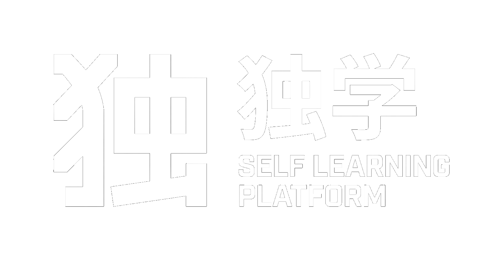

<div align="center">

<!-- omit in toc -->



**an agent-powered hub for self-learners**

[](https://selflearningplatform.github.io)
[](https://github.com/GustavoPenaBeltrami/self-learning-platform/stargazers)
[](https://github.com/GustavoPenaBeltrami/self-learning-platform/issues)
[](https://www.python.org/)
[](#installation)

<sub>made by [Gustavo Peña Beltrami](https://github.com/GustavoPenaBeltrami)</sub>

</div>

SLP is a self-hosted study environment you fully own: it runs on your machine, needs no subscription, and works with any agent and any model, local or paid.

Full documentation: [selflearningplatform.github.io/docs](https://selflearningplatform.github.io/docs/overview), also as [`llms.txt`](https://selflearningplatform.github.io/llms.txt). Each section below is a short version of a docs section.

## Introduction

### [Overview](https://selflearningplatform.github.io/docs/overview)

Reading is not learning. You learn when you express the material again and again, with someone pointing out your mistakes. SLP gives you that someone: an agent that teaches, quizzes, grades and brings your mistakes back before you forget them, plus a local app to take notes, sit exams and study cards.

SLP has two layers. The core is the app and your files: notes, exams, cards and session tracking. It works without an agent or a model, and every file is plain JSON or Markdown you can write by hand. The agent layer is optional: skills that teach, grade, give feedback and keep your progress and the wiki, on whatever model you plug in.

### [Prerequisites](https://selflearningplatform.github.io/docs/prerequisites)

Required: [uv](https://docs.astral.sh/uv/), which installs Python and the packages, and an internet connection the first time you run the app.

Recommended: [Claude Code](https://claude.com/claude-code) as the agent (any agent works), [VS Code](https://code.visualstudio.com/) to read the topic files and run the agent, [GitHub](https://github.com/) to keep your topics in a private repo, and [git](https://git-scm.com/) to clone this one.

### [Installation](https://selflearningplatform.github.io/docs/install)

```sh
curl -LsSf https://astral.sh/uv/install.sh | sh    # Windows: see the installation docs
git clone https://github.com/GustavoPenaBeltrami/self-learning-platform.git
cd self-learning-platform
uv run slp
```

Recommended setup: your material, the app and the agent side by side.

### [Getting started](https://selflearningplatform.github.io/docs/getting-started)

Open your agent at the repo root and send:

```
Read AGENTS.md, then read agent/skills/slp-setup/SKILL.md and follow it.
```

Then run `/slp-init` to create a topic. The agent interviews you and checks your level. Start every study session with `/slp-session`: it tells you what's pending and hands off to the right skill.

## [AI teacher](https://selflearningplatform.github.io/docs/ai-teacher)

The agent plays the teacher. It explains from what you already know, grades against a rubric and writes down your mistakes so they come back. The method lives in [skills](https://selflearningplatform.github.io/docs/skills) in the Agent Skills format, so they work with Claude Code, Codex, Gemini CLI, Cursor, opencode and others, on a cloud model or a local one via Ollama. `slp-setup` and `slp-init` are manual: they run only when you call them.

| Skill | Step | What it does |
|---|---|---|
| [`/slp-session`](https://selflearningplatform.github.io/docs/slp-session) | plan | What's pending today. Validates the sessions the app recorded and feeds the wiki |
| [`/slp-setup`](https://selflearningplatform.github.io/docs/slp-setup) | setup, manual | Exposes the skills and agents to your agent |
| [`/slp-init`](https://selflearningplatform.github.io/docs/slp-init) | setup, manual | Creates a topic and checks your level |
| [`/slp-summarize`](https://selflearningplatform.github.io/docs/slp-summarize) | prepare | Summarizes material into the topic's notes and wiki |
| [`/slp-teach`](https://selflearningplatform.github.io/docs/slp-teach) | prepare | Teaches until you understand, and writes the note and the wiki |
| [`/slp-exercises`](https://selflearningplatform.github.io/docs/slp-exercises) | practice | An applied exercise: code, an ADR, a critique |
| [`/slp-exam`](https://selflearningplatform.github.io/docs/slp-exam) | practice | Builds an exam you sit in the app |
| [`/slp-grade`](https://selflearningplatform.github.io/docs/slp-grade) | feedback | Grades an attempt against a rubric |
| [`/slp-quiz`](https://selflearningplatform.github.io/docs/slp-quiz) | control | A repeatable level quiz in the chat, from the same bank each time |
| [`/slp-cards`](https://selflearningplatform.github.io/docs/slp-cards) | review | Flashcards from your notes, studied in the app |

The [researcher](https://selflearningplatform.github.io/docs/researcher) agent verifies facts with sources, and each topic can have a [teacher-\<slug>](https://selflearningplatform.github.io/docs/teacher) persona the agent adopts while teaching. [Profiles](https://selflearningplatform.github.io/docs/profiles) set whether the agent layer and dictation run online or offline.

## [Visual interface](https://selflearningplatform.github.io/docs/deploy)

`uv run slp` serves the app at `http://localhost:8321`, local only.

- [notes](https://selflearningplatform.github.io/docs/editor): a notebook per topic, saved as Markdown as you type, with tables, Mermaid, LaTeX and images. You can upload sources and open local ones from here
- [exams](https://selflearningplatform.github.io/docs/exam-app): sit the exams the agent builds: multiple choice, open, practical and oral
- [cards](https://selflearningplatform.github.io/docs/cards-app): study flashcards with Leitner scheduling. Mark a card unsure and `/slp-session` goes over it with you
- [settings](https://selflearningplatform.github.io/docs/settings): profile, fonts, and themes, built in or generated from one color
- [dictation](https://selflearningplatform.github.io/docs/dictation): speak your notes or oral answers, transcribed locally with Whisper
- [shortcuts](https://selflearningplatform.github.io/docs/shortcuts): keyboard shortcuts for every view, dictation key included

The app also records your study sessions: any activity in a topic opens one and 30 idle minutes close it.

## [Filesystem](https://selflearningplatform.github.io/docs/topics)

Everything you study is a topic, and a topic is plain files you own. There is no database.

```
topics/<slug>/
├── topic.json    # goals, languages, sources, routine
├── learning.md   # mission, glossary, your mistakes
├── notes/  exams/  exercises/  cards/  resources/
├── wiki/         # the agent's map of the subject
└── progress/     # status.md, log.md, sessions.jsonl
```

Pages per file and folder: [topic.json](https://selflearningplatform.github.io/docs/topic-json), [learning.md](https://selflearningplatform.github.io/docs/learning-md), [notes/](https://selflearningplatform.github.io/docs/notes), [exams/](https://selflearningplatform.github.io/docs/exams), [exercises/](https://selflearningplatform.github.io/docs/exercises), [cards/](https://selflearningplatform.github.io/docs/cards), [wiki/](https://selflearningplatform.github.io/docs/wiki), [progress/](https://selflearningplatform.github.io/docs/progress), [settings.json](https://selflearningplatform.github.io/docs/settings-json), [agent/](https://selflearningplatform.github.io/docs/agent-dir).

Your topics are git-ignored and `topics/example/` shows the shape. To keep them, point the repo at your own: `git remote set-url origin <your-repo>`.

## Project

### [Contributing](https://selflearningplatform.github.io/docs/contributing)

Contributions are welcome: fork, branch, pull request. Edit skills in `agent/skills/`, never inside an agent's own folder. For bugs and ideas, [open an issue](https://github.com/GustavoPenaBeltrami/self-learning-platform/issues/new).

Thanks to [amosblomqvist/learn](https://github.com/amosblomqvist/learn) for the method behind `slp-teach` and to [Matt Pocock](https://github.com/mattpocock) for per-topic memory.

### [Roadmap](https://selflearningplatform.github.io/docs/roadmap)

Still pending: testing `slp-setup` on more agents, native dictation on Windows ARM, and keeping nested lists when notes are saved.

## License

[MIT](LICENSE)
